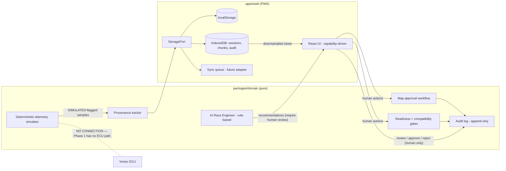

# MX LAB — System Architecture Overview

Purpose: Define the Phase 1 software architecture for MX LAB, a race-engineering platform for Yamaha YZ250F/YZ450F bikes running Vortex programmable ECUs, and the mapping to future production infrastructure.

Status: Phase 1 — simulation only. No ECU communication of any kind. All hardware is simulated. Pending physical verification of all Vortex-specific capabilities.

---

## 1. Design principles

| Principle | Consequence |
|---|---|
| Local-first | The app is fully functional offline. The network is an enhancement, never a dependency. |
| Simulation only (Phase 1) | No code path exists that transmits to an ECU. All telemetry originates from the deterministic simulator and is labeled SIMULATED. |
| AI recommends, never controls | The AI Race Engineer is a rule-based advisor. It produces recommendations that require human review; it holds no write authority anywhere in the system. |
| Nothing Vortex-specific hardcoded | Every ECU capability is data (an `ECUDefinition` with verification status), not code. See `docs/vortex/integration-boundary.md`. |
| Human decisions are durable | Approvals, tuner decisions, and audit records are never silently overwritten — not by sync, not by AI, not by migration. |

## 2. Monorepo layout

TypeScript monorepo, two primary workspaces:

```
mx-lab/
├── packages/
│   └── domain/          # Pure, dependency-free domain layer
└── apps/
    └── web/             # Vite + React PWA (offline-first)
```

### 2.1 `packages/domain` — typed models + pure engines

No I/O, no DOM, no network. Every engine is a pure function or deterministic state machine, unit-testable in isolation.

| Engine | Responsibility |
|---|---|
| Permissions | Role model (Owner, Tuner, Rider, Mechanic, Analyst, Viewer). Every mutating action is permission-checked in the domain layer, not the UI. |
| Readiness gates | Boolean gate evaluation for session/bike/map readiness. Gates are satisfied only by recorded evidence (human confirmation, verified data). AI inference can never satisfy a gate. |
| Compatibility gates | Bike ↔ ECU ↔ map ↔ hardware compatibility checks driven by inventoried identities, never by assumption. Model and model year are part of every compatibility key. |
| Map approval workflow | State machine: Draft → Proposed → Reviewed → Approved → Applied-Externally-Confirmed → Archived. Transitions require a named human actor; no automatic transitions. |
| Audit | Append-only event log of every significant action (who, what, when, prior value, new value). Audit entries are immutable. |
| Provenance | Every data artifact (telemetry session, map file, recommendation) carries origin metadata: source, adapter identity, simulation flag, verification status, chain of custody. |
| Deterministic telemetry simulator | Seeded, reproducible generator of session telemetry (RPM, throttle position, GPS trace, IMU, wheel speeds, temperatures). Always emits `source: SIMULATED`, quality `Simulated`. |
| AI Race Engineer | Rule-based recommendation engine over session data and setup history. Output is always a `Recommendation` requiring human review. See may-never list in `docs/safety/safety-boundary.md`. |

### 2.2 `apps/web` — Vite React PWA

- Offline-first PWA; service worker caches the application shell.
- Persistence: localStorage (small config/state) and IndexedDB (sessions, telemetry chunks, audit log) behind a typed `StoragePort` interface. The UI and domain layer never touch storage APIs directly.
- Capability-driven rendering: controls render only for capabilities present in the bike's verified `ECUDefinition` (see `docs/vortex/integration-boundary.md`).

```ts
interface StoragePort {
  get<T>(collection: string, id: string): Promise<T | undefined>;
  put<T>(collection: string, id: string, value: T): Promise<void>;
  query<T>(collection: string, filter: QuerySpec): Promise<T[]>;
  putChunk(sessionId: string, chunk: TelemetryChunk): Promise<void>;
  getChunks(sessionId: string, range: TimeRange, resolution: Resolution): Promise<TelemetryChunk[]>;
  enqueueSync(op: SyncOp): Promise<void>;
}
```

## 3. Data flow (Phase 1)



There is no arrow from any component to the ECU. That is by design and enforced by the absence of any transport code in Phase 1.

## 4. Production backend mapping (future adapter — not implemented in Phase 1)

The `StoragePort` and sync queue are the seams for a future backend. Target mapping:

| Concern | Target service | Rules |
|---|---|---|
| Identity | Firebase Auth | Role claims mirror the domain permission model; domain layer remains the authority. |
| Metadata | Firestore | Metadata only: bikes, sessions headers, maps, approvals, audit index, ECUDefinitions. High-rate telemetry samples must never be stored as individual Firestore documents. |
| Telemetry | Object storage (chunked files) | Binary columnar chunks per session per channel group. Downsampled pyramid views (e.g. 1 Hz, 10 Hz) generated for charting; full-resolution chunks retained for analysis. Chunk manifests live in Firestore; payloads live in object storage. |

### 4.1 Telemetry chunk format (target)

- Columnar layout: per-channel arrays within a chunk, fixed time window per chunk.
- Each chunk header: session id, channel group, time range, sample rate, encoding, checksum, provenance (adapter id, simulation flag), sync-quality snapshot.
- Charts read downsampled views; analysis tools read full resolution. The UI never loads full-resolution data for overview rendering.

## 5. Time-synchronization model

Multiple sources (future: ECU stream, GPS, IMU, wheel sensors; Phase 1: simulator emulating the same structure) are aligned to a **common session clock**:

- One session clock per logging session (monotonic, defined by the logger in future phases; by the simulator in Phase 1).
- Each source records: `offsetMs` (estimated offset to session clock), `driftPpm` (estimated drift rate), and `syncQuality` (`Locked`, `Estimated`, `Degraded`, `Unsynchronized`).
- Sync quality is recorded per chunk and surfaced in analysis; cross-source comparisons at degraded sync quality are flagged in the UI.
- GPS time (when available in future phases) is a candidate reference for absolute time; the session clock remains the alignment authority within a session.

## 6. Offline strategy and conflict policy

- **Local-first store**: all reads/writes hit local storage; the app is complete without a network.
- **Sync queue**: mutations are queued as ordered operations with actor, timestamp, and device id. The queue drains when a backend adapter exists and connectivity is available.
- **Conflict policy**: on divergence, both versions are preserved as siblings and flagged for **human review**. There is no automatic last-write-wins for domain objects.
- **Hard rule**: approvals, gate satisfactions, and tuner decisions are never silently overwritten by sync — a conflicting approval always produces a review task, never a merge.

## 7. Boundaries this document depends on

- Safety boundary and AI limits: `docs/safety/safety-boundary.md`
- Vortex integration boundary and phase model: `docs/vortex/integration-boundary.md`
- Hardware adapter contract: `docs/hardware/adapter-spec.md`
- Open questions requiring physical verification: `docs/testing/known-unknowns.md`
