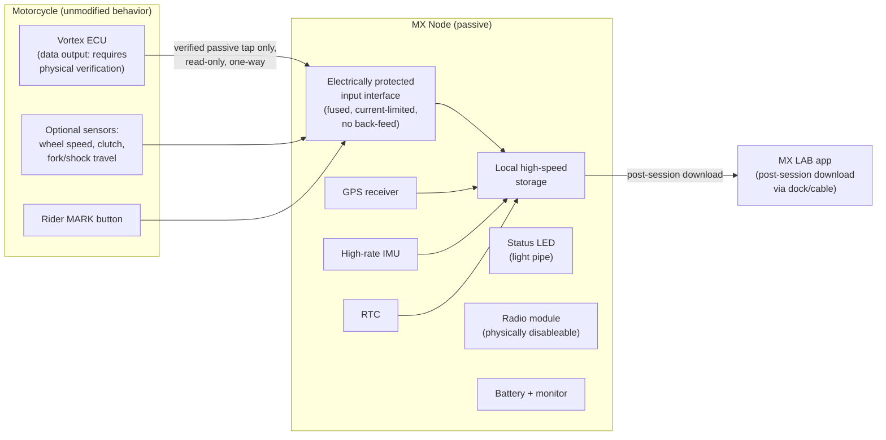

# MX Node — Vortex Edition: Passive Logger Design Brief

Purpose: Design brief for the MX Node, a strictly passive on-bike telemetry logger for Yamaha YZ250F/YZ450F with Vortex ECUs.

Status: Phase 2 target — design brief, pending physical verification. No hardware exists; nothing here authorizes connecting anything to a bike until per-model-year verification completes.

---

## 1. Non-negotiable boundary

The MX Node is **strictly passive**. It must never control fueling, ignition, throttle, map slots, or any engine behavior. It observes and records only. Its failure — hang, short, brownout, fire-and-forget firmware bug, physical destruction — must have no effect on the motorcycle's operation. Every electrical and mechanical decision below serves that rule.

Whether a usable Vortex data output exists, and in what form (CAN, proprietary stream, or none), **requires physical verification** per ECU model and firmware (see `docs/testing/known-unknowns.md`). This brief assumes only that *some* verified passive source may exist; if none does, the node still functions as a GPS/IMU/sensor logger.

## 2. Architecture

No arrow points from the node toward the ECU or any bike system. The input interface is one-way by hardware design, not by firmware promise.

## 3. Component candidates

All items are candidates/targets, not selections. No part numbers are asserted for Vortex or Yamaha components.

| Subsystem | Candidate / target | Notes |
|---|---|---|
| Input interface | Electrically protected, receive-only front end; series protection, current limiting, fusing per input; transceiver TX permanently disabled in hardware if a bus interface is fitted | Exact interface type depends on what verification finds (CAN vs proprietary vs nothing) |
| GPS | 10–25 Hz GNSS receiver, external antenna capable | Antenna mount: `docs/cnc/mark-button-and-sensor-mounts.md` |
| IMU | 6–9 axis, ≥ 200 Hz logging target, automotive/industrial grade | Orientation fixture required for repeatability |
| Local storage | Industrial eMMC or high-endurance SD, power-loss-safe filesystem, ≥ multiple race days capacity | Chunked columnar session format per `docs/architecture/overview.md` |
| RTC | Battery-backed RTC; session clock authority when GPS absent | Sync model per architecture doc |
| Optional inputs | Front/rear wheel speed, clutch position, fork travel, shock travel | Additive instrumentation only; never in series with OEM circuits |
| Rider MARK input | Debounced digital input for sealed handlebar button | Housing brief: `docs/cnc/mark-button-and-sensor-mounts.md` |
| Service connector | Rugged sealed connector; Deutsch DTM/ASX families are candidates | Recessed, strain-relieved (enclosure brief) |
| Radio disable | Physical mechanism (removable module, keyed plug, or switch with visible state) that disconnects radio at the hardware level | Required for competition mode; state is inspectable |
| Status LED | Single multi-color LED via sealed light pipe | States: logging, fault, storage low, battery low, RADIO DISABLED |
| Battery monitoring | Voltage/temperature monitoring of node battery; node is self-powered as baseline; any bike power tap is TBD pending per-model-year verification | A dead node battery must only stop logging |
| Vibration isolation | Elastomer-isolated internal assembly | Enclosure brief |
| Enclosure | Sealed billet enclosure, target IP67 | `docs/cnc/enclosure-brief.md` |

## 4. Test mode vs competition mode

| Behavior | Test mode | Competition mode |
|---|---|---|
| Local logging | On | On |
| Radio | Permitted where legal | **Physically disabled**; disable state confirmed and recorded |
| Live telemetry | Permitted where legal | None unless explicitly authorized by the sanctioning body |
| Sensors | Any inventoried sensor | Approved sensor list for that body only |
| Data retrieval | Live or download | Post-session download only |
| Hardware state | — | Inspectable on request (visible radio-disable state, seals) |

Full competition-mode requirements: `docs/hardware/competition-mode.md`.

COMPETITION USE REQUIRES APPROVAL FROM THE APPLICABLE SANCTIONING BODY. SOFTWARE CONFIGURATION DOES NOT ESTABLISH LEGALITY.

## 5. Electrical protection requirements

- Every input current-limited and fused; fuse sizing TBD after harness survey per model year.
- **No back-feed into the bike harness** under any node fault, including reverse polarity, internal short, or battery failure — enforced by hardware topology (series protection, isolation), verified by fault-injection test on the bench fixture before any bike install.
- If a bus transceiver is fitted, transmit capability is disabled in hardware (TX line not connected / driver unpopulated), not merely in firmware.
- Node power is independent of bike systems as baseline. Any future bike power tap is a separate, per-model-year verified design with its own fusing, and must be removable without affecting the bike.
- All bike-facing wiring uses connectors so the node and harness are fully removable, restoring the bike to stock.

## 6. Single-point-of-failure analysis

| Failure | Effect on bike | Effect on data | Mitigation |
|---|---|---|---|
| Node CPU hang | None (passive) | Session gap | Watchdog restart; gap flagged in sync quality |
| Storage failure | None | Session lost | Health check at dock (`docs/cnc/pit-dock-brief.md`); wear monitoring |
| Node battery dead | None | No logging | Battery monitoring, LED + dock warning |
| Input front-end short | None — fused, isolated; verified by fault injection | Channel Missing | Protection topology; bench-fixture fault tests |
| GPS antenna damage | None | Position/sync degraded | Sync-quality flags; IMU-only fallback |
| Connector water ingress | None to bike | Channel Intermittent | Sealed connectors, replaceable seals |
| Firmware defect | None — no control path exists to affect the bike | Data quality risk | Read-only architecture; deterministic test suite |
| Crash damage to node | None beyond the crash itself | Possible session loss | Isolated mounting, enclosure spec; mount survey per model year |

Design rule: no MX Node failure mode may appear in any bike-effect column as anything other than "None." A design that cannot demonstrate this on the bench does not go on a bike.
